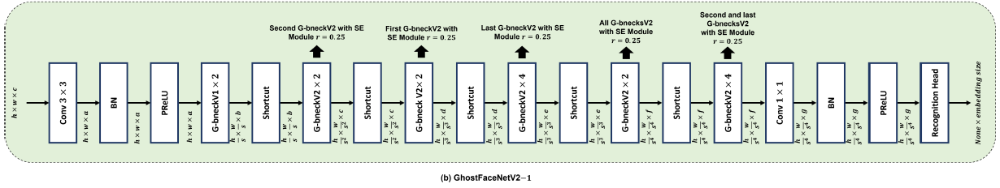
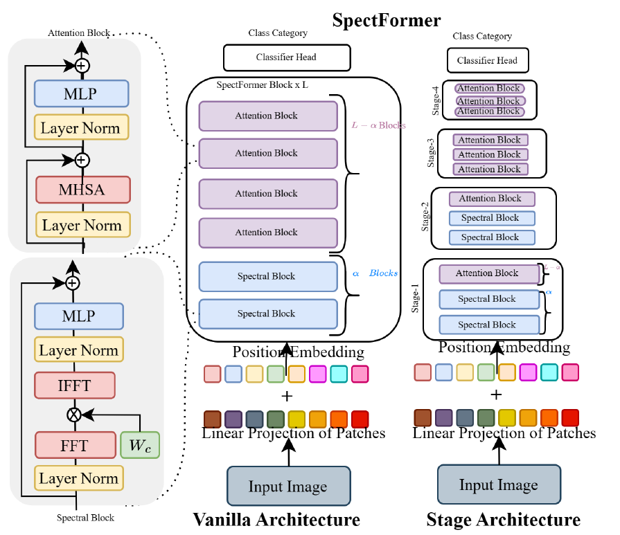
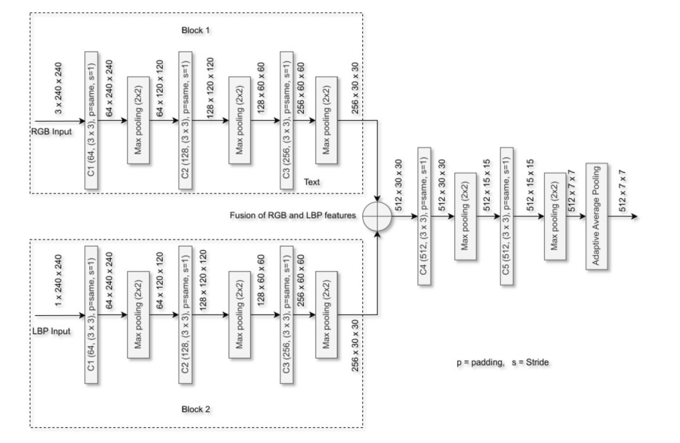

# Ellzaf ML
Implementations of ML papers in PyTorch

[](https://pepy.tech/project/ellzaf_ml)
[](https://pepy.tech/project/ellzaf_ml)

## Install
```bash
$ pip install ellzaf_ml
```

## GhostFaceNets
</img>
PyTorch version of [GhostFaceNets](https://github.com/HamadYA/GhostFaceNets/tree/main).

GhostNetV2 code from [Huawei Noah's Ark Lab](https://github.com/huawei-noah/Efficient-AI-Backbones/tree/master).

Loss function code from [Insight Face](https://github.com/deepinsight/insightface/blob/master/recognition/arcface_torch/losses.py).

```python
import torch
from ellzaf_ml.ghostfacenetsv2 import ghostfacenetsv2

IMAGE_SIZE = 112

#return embedding
model = ghostfacenetsv2(image_size=IMAGE_SIZE, width=1, dropout=0., args=None)
img = torch.randn(3, 3, IMAGE_SIZE, IMAGE_SIZE)
display(model(img))

#return classification
model = ghostfacenetsv2(image_size=IMAGE_SIZE, num_classes=3, width=1, dropout=0., args=None)
img = torch.randn(3, 3, IMAGE_SIZE, IMAGE_SIZE)
model(img)
```

In order to not use GAP like mentioned in the paper, you need to specify the image size.

### TODO
- [x] Replicate model.
- [ ] Create training code.

## SpectFormer
</img>

Implementation of [SpectFormer](https://arxiv.org/abs/2304.06446) vanilla architecture.

Code is modified version of ViT from [Vit-PyTorch](https://github.com/lucidrains/vit-pytorch/tree/main).

```python
import torch
from ellzaf_ml.spectformer import SpectFormer

model = SpectFormer(
        image_size = 224,
        patch_size = 16,
        num_classes = 1000,
        dim = 512,
        depth = 12,
        heads = 16,
        mlp_dim = 1024,
        spect_alpha = 4, # amount of spectral block (depth - spect_alpha = attention block)
) 

img = torch.randn(1, 3, 224, 224)
preds =  model(img) # prediction -> (1,1000)
```

SpectFormer utilizes both spectral block and attention block. The amount of spectral block can be speciified using spect_alpha and the remaining block from depth will be attention blocks.

depth - spect_alpha = attention block

12 - 4 = 8

From the code and calculation example above, when spect_alpha are 4 with the depth of 12. The resulting attention block will be 8. If spect_alpha == depth, it will be GFNet while if spect_alpa = 0, it will be ViT.

## LBP and CNN Feature Fusion for face anti-spoofing
</img>

Implementation of [LBP and CNN Feature Fusion for face anti-spoofing](https://link.springer.com/article/10.1007/s10044-023-01132-4)

```python
import torch
from ellzaf_ml.lcff import LBPCNNFeatureFusion

model = LBPCNNFeatureFusion(num_classes=2)
img = torch.rand(1, 3, 224, 224)
preds = model(img) # prediction -> (1,2)
```
This model is primarily used for face liveness.

I also modified it to use with MobileNetV3 after concatenating the features from the two blocks.
```python
import torch
from ellzaf_ml.lcff import LBPCNNFeatureFusion

model = LBPCNNFeatureFusion(num_classes=2, backbone="mobilenetv3")
img = torch.rand(3, 3, 224, 224)
preds = model(img) # prediction -> (1,2)
```