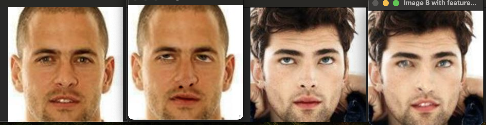
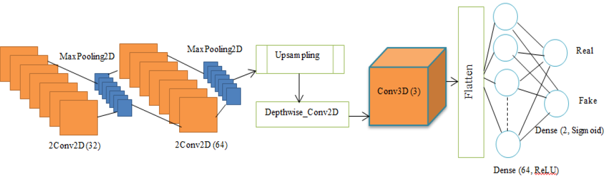

<div align="center">
  <p>
    <a align="center" href="" target="_blank">
      
    </a>
  </p>

<br>

[](https://pepy.tech/project/ellzaf_ml)
[](https://pepy.tech/project/ellzaf_ml)

</div>

## 🤔What is ellzaf_ml?
This package thoughtfully combines machine learning models and data augmentation methods sourced from academic research with practical tools designed to enhance the training of AI models, all seamlessly integrated into PyTorch.

## 📦Install
```bash
$ pip install ellzaf_ml
```

### ❓Requests
If you have any papers that are not implemented in PyTorch or not yet implemented in any frameworks, you can open an issue for this.

### 🔬 Experimental
Any model that can be use in different way from the paper will be inside Experimental tag.

## 🔎 Contents
🦾Data Augmentation
1. [PatchSwap](https://github.com/Hazqeel09/ellzaf_ml#patchswap)

⚡ Models
1. [GhostFaceNets](https://github.com/Hazqeel09/ellzaf_ml#ghostfacenets)
2. [SpectFormer](https://github.com/Hazqeel09/ellzaf_ml#spectformer)
3. [LBP and CNN Feature Fusion for face anti-spoofing](https://github.com/Hazqeel09/ellzaf_ml#lbp-and-cnn-feature-fusion-for-face-anti-spoofing)
4. [LDnet with the combination of 2D and 3D](https://github.com/Hazqeel09/ellzaf_ml#ldnet-with-the-combination-of-2d-and-3d)

🛠️ Tool
1. [PyTorch Early Stopping](https://github.com/Hazqeel09/ellzaf_ml#earlystopping)

## 🦾Data Augmentation
### 💡PatchSwap
An implementation of [PatchSwap: Boosting the Generalizability of Face Presentation Attack Detection by Identity-aware Patch Swapping](https://ieeexplore.ieee.org/document/10007946).

PatchSwap applied to same person:
</img>

PatchSwap applied to different person:
</img>

First (Image A) and third (Image B) picture from the left are the original image.

The second picture from the left is when the eyes, nose, and mouth from Image B is applied to Image A.

The fourth picture from the left is when the eyes, nose, and mouth from Image A is applied to Image B.

```python
from ellzaf_ml.augments import PatchSwap

swapper = PatchSwap()
image_a, image_b = swapper.swap_features('path/to/face_imageA.jpg', 'path/to/face_imageB.jpg')

# you can specify facial features that you want to swap, default value is ["right_eye", "left_eye", "nose", "lips"]
image_c, image_d = swapper.swap_features('path/to/face_imageC.jpg',
                                         'path/to/face_imageD.jpg',
                                         features_to_swap=["left_eye", "nose",])

# optional to see the images
if image_a is not None and image_b is not None:
    swapper.show_image(image_a, 'Image A with features from B', image_b, 'Image B with features from A')

# go through images in folder
input_dir = 'path/to/real_face_folder'
output_dir = 'path/to/fake_face_folder'

# Call the class method with the input and output directories
swapper.swap_features_in_directory(input_dir, output_dir)
```

Key differences:
1.  Instead of using dlib, I use MediaPipe for face landmark
2.  I only swap eyes instead of eyes and eye brows

If you want to follow the paper method, use input folder consisting of the same person for `swap_features_in_directory`.

## ⚡ Models
### 🌟GhostFaceNets
</img>
PyTorch version of [GhostFaceNets](https://github.com/HamadYA/GhostFaceNets/tree/main).

GhostNetV2 code from [Huawei Noah's Ark Lab](https://github.com/huawei-noah/Efficient-AI-Backbones/tree/master).

Loss function code from [Insight Face](https://github.com/deepinsight/insightface/blob/master/recognition/arcface_torch/losses.py).

```python
import torch
from ellzaf_ml.models import ghostfacenetsv2

IMAGE_SIZE = 112

#return embedding
model = ghostfacenetsv2(image_size=IMAGE_SIZE, width=1, dropout=0., args=None)
img = torch.randn(3, 3, IMAGE_SIZE, IMAGE_SIZE)
model(img)

#return classification
model = ghostfacenetsv2(image_size=IMAGE_SIZE, num_classes=3, width=1, dropout=0., args=None)
img = torch.randn(3, 3, IMAGE_SIZE, IMAGE_SIZE)
model(img)
```

In order to not use GAP like mentioned in the paper, you need to specify the image size.

You also need to have image_size>=33.

#### TODO
- [x] Replicate model.
- [ ] Create training code.


### 🌟SpectFormer
</img>

Implementation of [SpectFormer](https://arxiv.org/abs/2304.06446) vanilla architecture.

Code is modified version of ViT from [Vit-PyTorch](https://github.com/lucidrains/vit-pytorch/tree/main).

```python
import torch
from ellzaf_ml.models import SpectFormer

model = SpectFormer(
        image_size = 224,
        patch_size = 16,
        num_classes = 1000,
        dim = 512,
        depth = 12,
        heads = 16,
        mlp_dim = 1024,
        spect_alpha = 4, # amount of spectral block (depth - spect_alpha = attention block)
) 

img = torch.randn(1, 3, 224, 224)
preds =  model(img) # prediction -> (1,1000)
```

SpectFormer utilizes both spectral block and attention block. The amount of spectral block can be speciified using `spect_alpha` and the remaining block from `depth` will be attention blocks.

depth - spect_alpha = attention block

12 - 4 = 8

From the code and calculation example above, when `spect_alpha` are 4 with the `depth` of 12. The resulting attention block will be 8. If `spect_alpha` == `depth`, it will be GFNet while if spect_alpa = 0, it will be ViT.


### 🌟LBP and CNN Feature Fusion for face anti-spoofing
</img>

Implementation of [LBP and CNN Feature Fusion for face anti-spoofing](https://link.springer.com/article/10.1007/s10044-023-01132-4)

This model is primarily used for face liveness.

```python
import torch
from ellzaf_ml.models import LBPCNNFeatureFusion

model = LBPCNNFeatureFusion(num_classes=2)
img = torch.rand(1, 3, 224, 224)
preds = model(img) # prediction -> (1,2)
```

<details>
    <summary> 🔬 Experimental [Click Here] </summary>
I also modified it to use with other models as backbone after concatenating the features from the two blocks.
You need to specify the number of classes from the backend model instead of LBPCNNFeatureFusion.

You can modify the number of channels after the features are concatenated using `adapt` and `adapt_channels`.

In order to obtain the image size for backbone model, you need to divide your current image size with 8.

#### MobileNetV3
We need to use `adapt=True` so that the number of channels will be 3 instead of 512.
```python
import torch
import timm
from ellzaf_ml.models import LBPCNNFeatureFusion

mobilenetv3 = timm.create_model('mobilenetv3_large_100.ra_in1k', pretrained=True)
mobilenetv3.classifier = torch.nn.Linear(mobilenetv3.classifier.in_features, 2) #specify number of class here

model = LBPCNNFeatureFusion(backbone="mobilenetv3", adapt=True, backbone_model=mobilenetv3)
img = torch.rand(3, 3, 224, 224)
preds = model(img) # prediction -> (3,2)
```

#### SpectFormer
You can choose to use the 512 channels from the concatenated block output or adapt like MobileNetV3.
```python
import torch
from ellzaf_ml.models import LBPCNNFeatureFusion, SpectFormer

spect_m = SpectFormer(
    image_size = 28,
    patch_size = 7,
    num_classes = 2, # specify amount of classes here
    channels = 512, #512 channels if you want to change only the backbone
    dim = 256,
    depth = 12,
    heads = 4,
    mlp_dim = 512,
    att_dropout = 0.01,
    ff_dropout = 0.1,
    spect_alpha = 4, # amount of spectral block (depth - spect_alpha = attention block)
)
model = LBPCNNFeatureFusion(backbone="spectformer", backbone_model=spect_m)
img = torch.rand(3, 3, 224, 224)
preds = model(img) # prediction -> (3,2)
```

#### GhostFaceNets
If you prefer different number of channels instead, you can specify it using `adapt_channels`.

Note: GhostFaceNets only works with `image_size` higher than 32.
```python
import torch
from ellzaf_ml.models import LBPCNNFeatureFusion, ghostfacenetsv2

gfn_m = ghostfacenetsv2(image_size=33, width=1,  num_classes=3, channels=10, dropout=0., args=None)

model = LBPCNNFeatureFusion(backbone="ghostfacenets", adapt=True, adapt_channels=10, backbone_model=gfn_m)
img = torch.rand(3, 3, 264, 264)
preds = model(img) # prediction -> (3,2)
```
</details>

### 🌟LDnet with the combination of 2D and 3D
</img>

Implementation of [A novel Deep CNN based LDnet model with the combination of 2D and 3D CNN for Face Liveness Detection.](https://ieeexplore.ieee.org/document/9914362)

This model primary use is for face liveness.
```python
import torch
from ellzaf_ml.models import LDnet

model = LDnet(image_size=64)
img = torch.rand(1, 3, 64, 64)
preds = model(img) # prediction -> (1,2)
```

## 🛠️ Data Augmentation
### ✨ EarlyStopping

Ease early stopping process during model training. This code is from [here](https://github.com/Bjarten/early-stopping-pytorch) and I modified some of it based on the issues from that GitHub.

```python
import torch
from torch import nn, optim

# Assuming 'model' has been defined and modified for a 2-class output
device = torch.device("cuda" if torch.cuda.is_available() else "cpu")
model.to(device)

criterion = nn.CrossEntropyLoss()
optimizer = optim.Adam(model.parameters(), lr=0.001)

# initialize the early_stopping object
 early_stopping = EarlyStopping(patience=10, verbose=True)

num_epochs = 100  # Define the number of epochs you want to train for

for epoch in range(num_epochs):
    model.train()
    running_loss = 0.0
    correct_predictions = 0

    for inputs, labels in train_loader:
        inputs, labels = inputs.to(device), labels.to(device)

        optimizer.zero_grad()
        outputs = model(inputs)
        loss = criterion(outputs, labels)
        loss.backward()
        optimizer.step()

        running_loss += loss.item()
        _, predictions = torch.max(outputs, 1)
        correct_predictions += (predictions == labels).sum().item()

    epoch_loss = running_loss / len(train_loader.dataset)
    epoch_acc = correct_predictions / len(train_loader.dataset)

    model.eval()
    val_running_loss = 0.0
    val_correct_predictions = 0

    with torch.no_grad():
        for inputs, labels in val_loader:
            inputs, labels = inputs.to(device), labels.to(device)
            outputs = model(inputs)
            loss = criterion(outputs, labels)

            val_running_loss += loss.item()
            _, predictions = torch.max(outputs, 1)
            val_correct_predictions += (predictions == labels).sum().item()

    val_epoch_loss = val_running_loss / len(val_loader.dataset)
    val_epoch_acc = val_correct_predictions / len(val_loader.dataset)

    # early_stopping needs the validation loss to check if it has decresed, 
    # and if it has, it will make a checkpoint of the current model
    early_stopping(valid_loss, model)
    
    if early_stopping.early_stop:
        print("Early stopping")
        break

    print(f'Epoch {epoch+1}/{num_epochs}')
    print(f'Train Loss: {epoch_loss:.4f} Acc: {epoch_acc:.4f}')
    print(f'Val Loss: {val_epoch_loss:.4f} Acc: {val_epoch_acc:.
```
